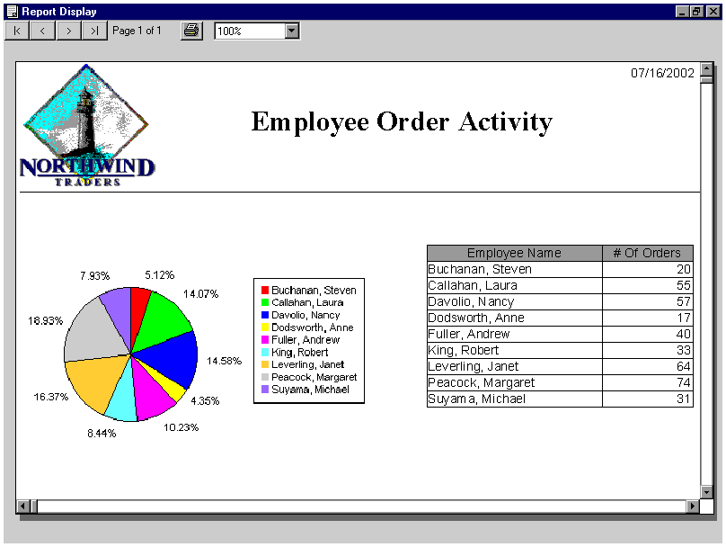



## embed a piechart into a report

### Description

The code show how to embed a piechart into a report using Visual Reports and Chart Director.

You will need to have Visual Reports and Chart Director on your workstation in order for the code to work. Visual Reports is the report writer and Chart Director is the charting tools.
 
### More Info
 
You will need to have Visual Reports and Chart Director in your workstation in order for the code to work.

             |
---                |---
**Submitted On**   |2002-07-16 16:16:34
**By**             |[Chicago Coder](https://github.com/Planet-Source-Code/PSCIndex/blob/master/ByAuthor/chicago-coder.md)
**Level**          |Advanced
**User Rating**    |5.0 (10 globes from 2 users)
**Compatibility**  |VB 6\.0
**Category**       |[Graphics](https://github.com/Planet-Source-Code/PSCIndex/blob/master/ByCategory/graphics__1-46.md)
**World**          |[Visual Basic](https://github.com/Planet-Source-Code/PSCIndex/blob/master/ByWorld/visual-basic.md)
**Archive File**   |[Imbed\_a\_pi1069577162002\.zip](https://github.com/Planet-Source-Code/chicago-coder-embed-a-piechart-into-a-report__1-36962/archive/master.zip)

